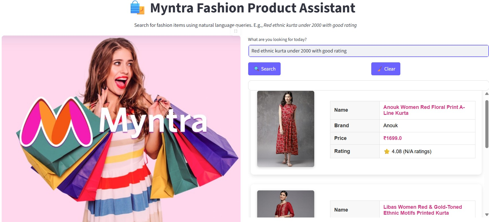

### Problem Statement

In today’s fast-paced digital era, online fashion platforms host **millions of product listings** across categories, brands, sizes, colors, and styles. While traditional search filters (like drop-downs or checkboxes) work to some extent, they often fall short in understanding **natural language queries** and **personalized preferences** from users. Customers are forced to manually refine filters repeatedly to find what they truly want — leading to frustration, abandonment, and poor user experience.

Despite powerful search engines, **modern shoppers demand a more intuitive & intelligent interface** — one that understands their needs just like a **human shopping assistant** would.

### Existing Challenges

- How can we enable users to **search fashion products** using **conversational, natural language** like:

    - "Show me blue cotton kurtas under ₹1500 with 4+ rating"
    - "Looking for a festive red anarkali with dupatta and good reviews"

- How can we intelligently **extract relevant filters** from such queries (e.g., color, category, price, rating)?

- Can we present results in a **visually rich, personalized, and interactive format** to improve engagement and user satisfaction?

- How can we further enhance the system with **conversational memory, data analysis, and database interaction** to support agents like:

    - Conversational LLM assistant

    - SQL agent for backend querying

    - CSV/pandas agent for analytics?

### Project Goals

To design and build an AI-powered Conversational Fashion Assistant for Myntra that can:

- ✅ Accept free-form natural language queries from users.

- ✅ Extract structured filters using LLM (e.g., price range, color, occasion).

- ✅ Retrieve top matching products using semantic search and similarity scoring.

- ✅ Display results in a visually appealing grid format, with product image, price, brand, and rating.

- ✅ Enhance customer interaction via a rich, real-time chatbot interface.

- ✅ Support conversational agents for SQL, data analytics, and real-time decision support

### Project Overview

**Myntra Conversational Fashion Search AI Assistant** is an AI-powered Streamlit web application that allows users to search fashion products using natural language queries like:

"Show me black cotton kurtas under ₹1000 with 4+ rating"

The assistant understands user intent using **LLM-based prompt engineering**, extracts relevant filters, retrieves matching products from a vectorized search index, and displays the top results in a visually rich, interactive UI.

The system is designed to simulate a **smart, real-time personal shopping assistant** using advanced NLP, vector search, and LLM agents.

### Tech Stack & Architecture

                      ┌────────────────────────────┐
                      │    User Interface (UI)     │
                      │  Streamlit App (app.py)    │
                      └────────────┬───────────────┘
                                   │
                    ┌──────────────▼──────────────┐
                    │ Natural Language Input (LLM)│
                    │  LangChain                  |
                    | OpenAI GPT-3.5-turbo        │
                    └──────────────┬──────────────┘
                                   │
             ┌─────────────────────▼──────────────────────┐
             │ Filter Extractor (Prompt Engineering)       │
             │ Extracts filters: price, color, rating, etc.│
             └─────────────────────┬──────────────────────┘
                                   │
                      ┌────────────▼─────────────┐
                      │  Semantic Vector Search   │
                      │  FAISS + Embeddings       │
                      └────────────┬──────────────┘
                                   │
                      ┌────────────▼──────────────┐
                      │ Product Database (SQLite) │
                      │ via Pandas + SQLAlchemy   │
                      └────────────┬──────────────┘
                                   │
                      ┌────────────▼──────────────┐
                      │ Product Grid Display (HTML)│
                      │ Includes image, brand, etc.│
                      └────────────────────────────┘

### Why LangChain is an Ideal Framework ?

| Feature                       | Why It’s Ideal for Your Fashion Assistant                                          |
| ----------------------------- | ---------------------------------------------------------------------------------- |
| **Prompt Management**         | Templates for extracting filters, summarizing results, handling follow-ups         |
| **LLM Chains**                | Easily connect user inputs → prompts → LLM → response                              |
| **Tool Integration**          | Add custom tools (like Pandas or SQL agents) for analytics                         |
| **Memory & Context**          | Allow multi-turn conversation for refining searches or asking follow-ups           |
| **Agents**                    | You can create an autonomous fashion analyst or recommender that picks tools       |
| **Streaming & Async**         | Support smooth, responsive user experiences                                        |
| **Vector Search Integration** | Easily plug in FAISS or Chroma to enable semantic search over product descriptions |
| **Built-in Observability**    | Debug, trace, and optimize your query chains                                       |

### Real Use Cases Made Easy with LangChain

| Capability                                 | How LangChain Helps                                                                                 |
| ------------------------------------------ | --------------------------------------------------------------------------------------------------- |
| 🧾 **Convert Natural Language to Filters** | Use `LLMChain` or `PromptTemplate` + `ChatOpenAI` to extract filters (price, rating, brand, gender) |
| 🔍 **Semantic Product Search**             | Use `FAISS` + `OpenAIEmbeddings` to semantically retrieve relevant products                         |
| 📈 **Data Analytics Agent**                | Use `PandasAgent` or `CSVAgent` to let LLM run analytics on the dataset                             |
| 💬 **Conversational Agent**                | Use `ConversationChain` or `ChatPromptTemplate` + Memory for contextual chat                        |
| 📦 **SQL Agent (Advanced)**                | LangChain’s `SQLDatabaseChain` or `SQLAgent` lets the LLM run SQL queries directly                  |
| ⚙️ **Tool Orchestration**                  | Agents can decide when to search, summarize, analyze, or clarify                                    |
| 🧠 **Summarization / Ranking**             | Use a summarization chain to re-rank or describe the top 3 products                                 |

### Key Features of Myntra Fashion Product AI Assistant

| Feature                                | Description                                                                          |
| -------------------------------------- | ------------------------------------------------------------------------------------ |
| 🧠 **Natural Language Search**         | Users can search with phrases like *“Blue denim jacket under 2000”*                  |
| 🔍 **LLM-Powered Filter Extraction**   | Extract filters like `price`, `rating`, `color`, `category` using LangChain & OpenAI |
| 📦 **Product Retrieval Engine**        | Retrieves top matching products using FAISS + cosine similarity                      |
| 🖼️ **Rich Visual Display**             | Products displayed with images, names, prices, brands, and ratings                   |
| 💬 **Conversational Chat Interface**   | Built-in chat interface for user interaction                                         |
| 📊 **Data Analytics Agent**            | Pandas-based agent to analyze product data                                           |
| 🧾 **SQL Agent**                       | LangChain SQL agent to query product DB                                              |
| 🎨 **Beautiful UI with CSS**           | Styled interface with custom buttons, dark mode, and grid layout                     |
| 🧹 **Clear Query Button**              | Instantly resets the query and clears results                                        |

### User Queries & Responses using Conversational Agent 

**User Query1:**
 
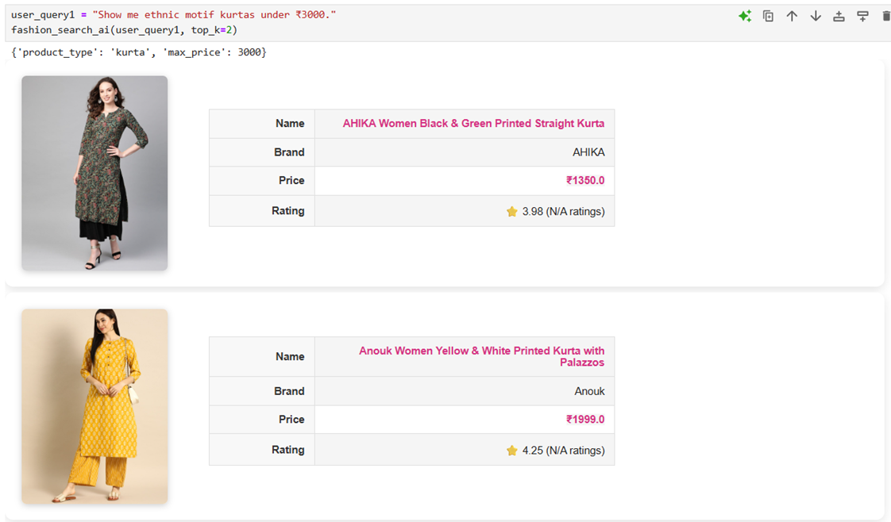

**User Query2:**

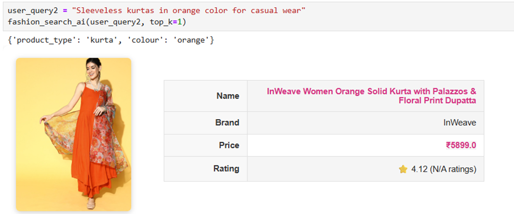

**User Query3:**

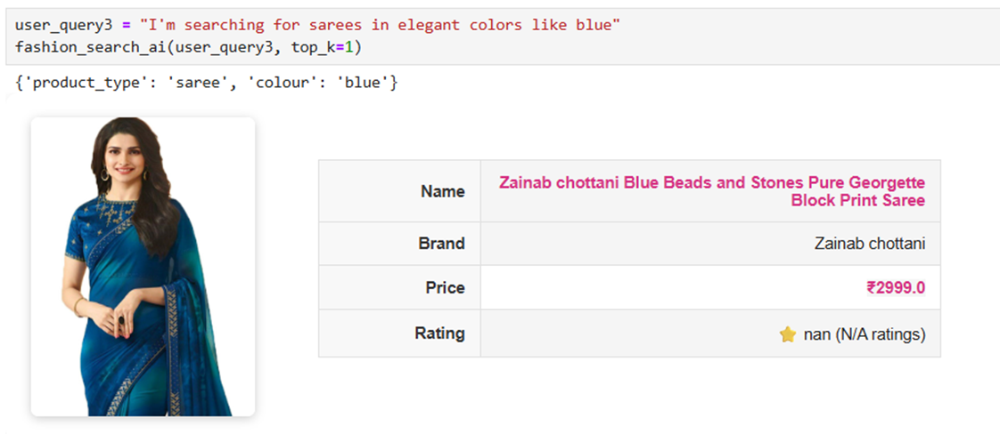

**User Query4:**

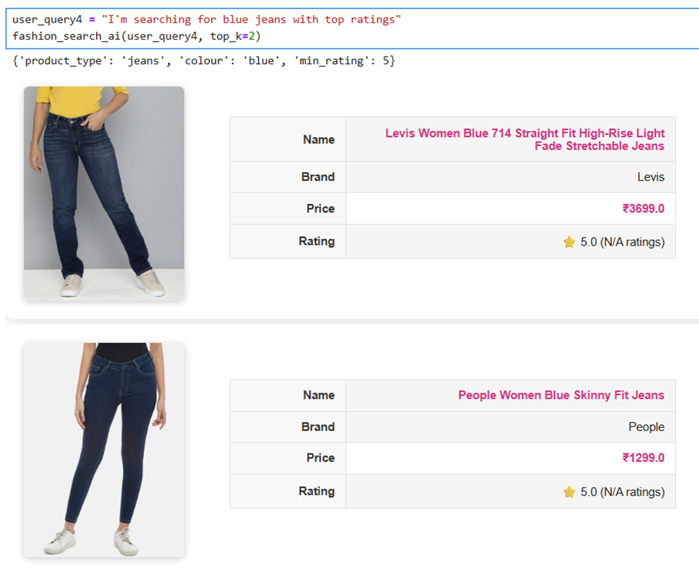

**User Query5:**
 
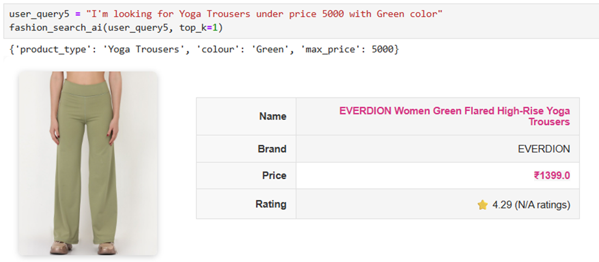

**SQL Agent Query Example:**

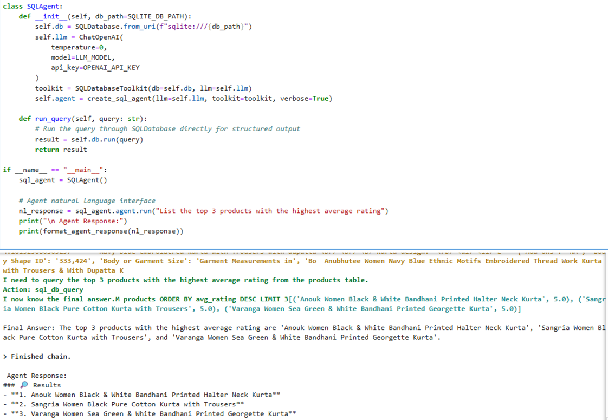

**Data Analytics Agent Query Example**
 
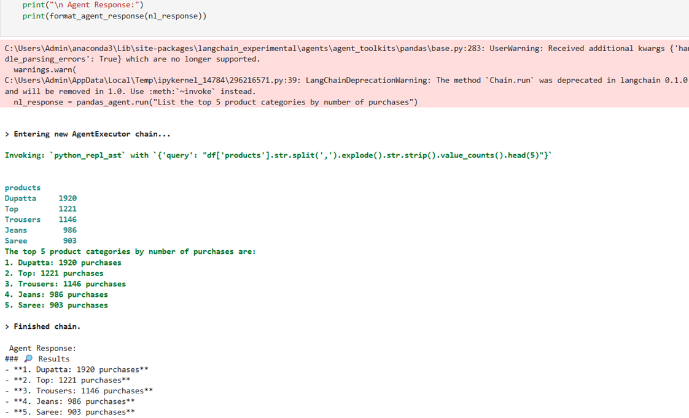

#### Myntra Fashion Product Search AI Assistant Bot using Streamlit

#### Fashion Search AI Bot User Interface:
 
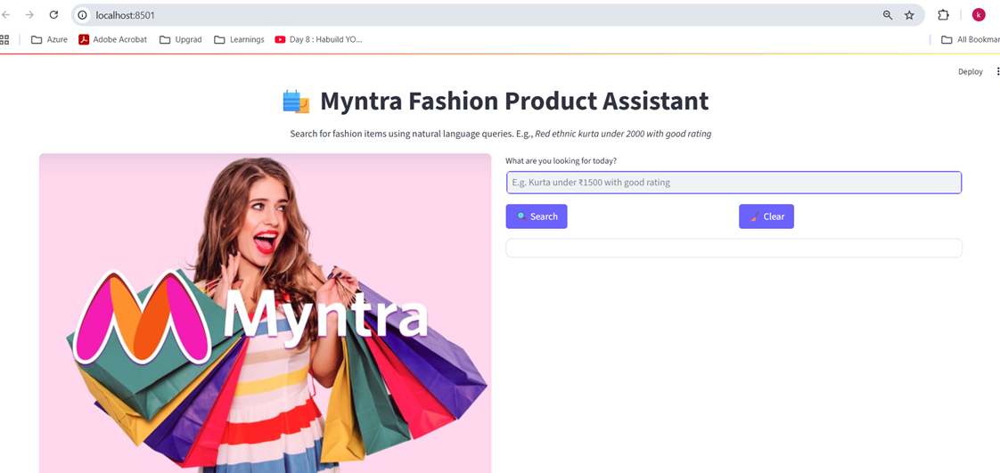

**User asking Query in Chatbox:**
 
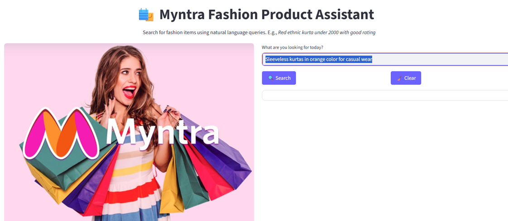

**Fashion Search AI Bot response for user query:**
 
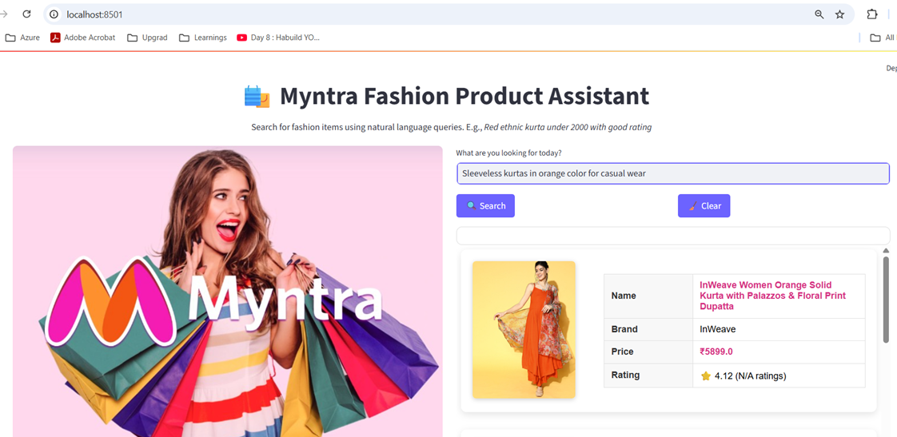

**User Query & Response using Conversational Agent:**
 
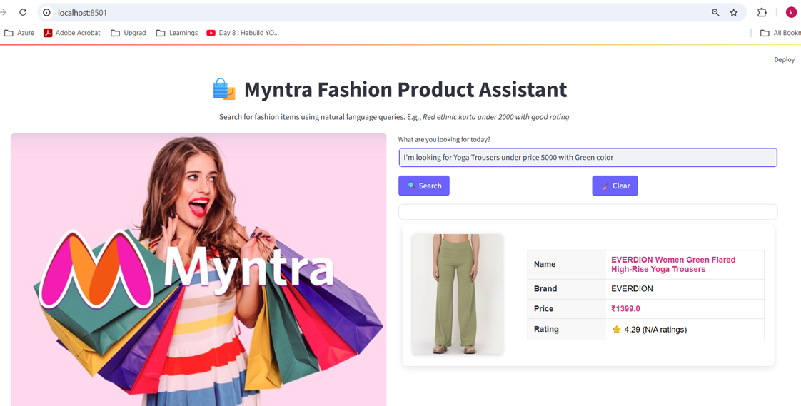

### Future Enhancements

| Enhancement                          | Description                                               |
| ------------------------------------ | --------------------------------------------------------- |
| 🧠 **Conversational Memory**         | Remember user preferences in ongoing sessions             |
| 🛍️ **Personalized Recommendations** | Suggest products based on user history or profile         |
| 🖼️ **Image-Based Search**           | Let users upload images to find similar products          |
| 📦 **Add-to-Cart Integration**       | Link results with Myntra cart / checkout                  |
| 🗣️ **Voice Input Support**          | Enable voice-based product search                         |
| 📊 **Advanced Analytics Dashboard**  | Use Streamlit Charts to analyze product trends            |
| 🌐 **Multi-language Support**        | Understand queries in Hindi, Tamil, etc.                  |
| 🤖 **AI Chatbot Agent Integration**  | Fully conversational chatbot with memory, sentiment, etc. |
| 🔒 **User Authentication**           | Secure login and personalized view                        |
| 🌓 **Dark Mode Toggle**              | Improve user experience for night use                     |

### Deployment Guide

1.	Download or clone the repo: 
git clone https://github.com/mkviswanadh/Fashion_Search_AI.git 
2.	Navigate into the fashion_product_search_bot folder where fashion_search_bot.py, dependencies, configs, pipeline files reside.
3.	Create & Activate a Python Virtual Environment • In PowerShell or CMD: cd path\to\chatbot_app python -m venv venv .\venv\Scripts\activate
4.	Install Dependencies with the command in the venv : pip install -r requirements.txt 
5.	Set Environment variables for OPENAI_API_KEY
6.	Run Pre-process pipeline: python pipelines/preprocess_data.py
7.	Create FAISS index : python pipelines/build_vector_store.py
8.	Ingest the data into Sqllite table : python pipelines/init_db.py
9.	Run the Streamlit App with below specified command:
streamlit run app.py --server.port 8501 --server.address 0.0.0.0
10.	Check in Browser Open your browser: http://127.0.0.1:8501  or http://localhost:8501  You should see the chatbot interface or default home page rendered.
